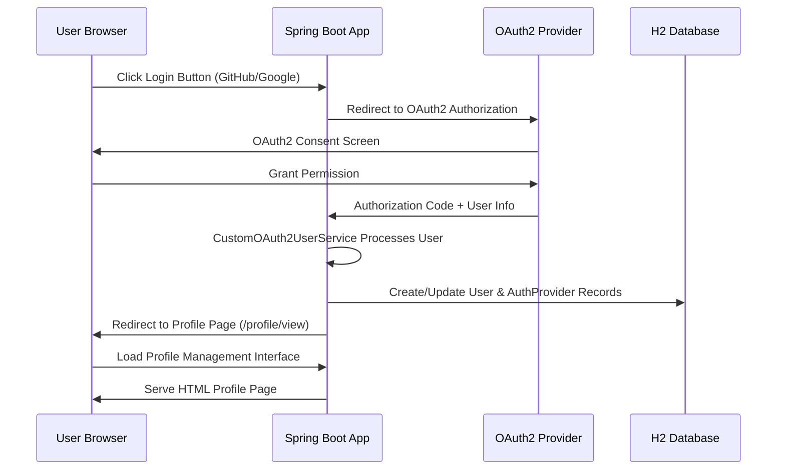
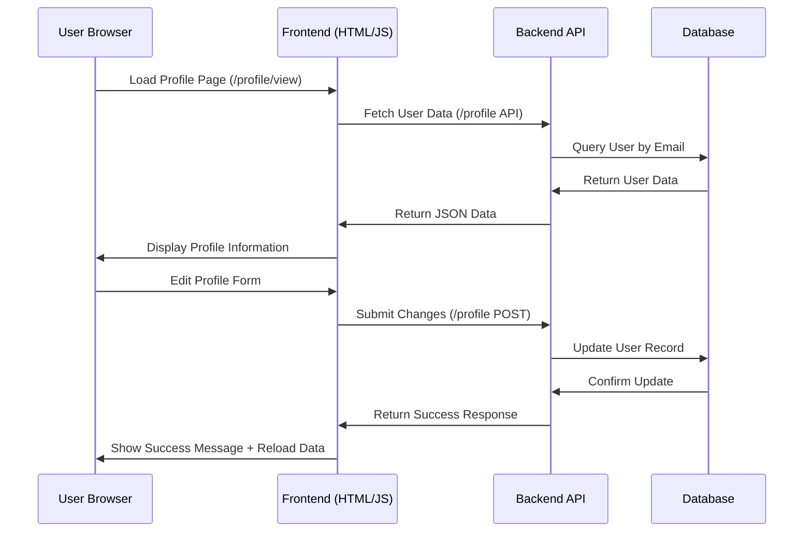
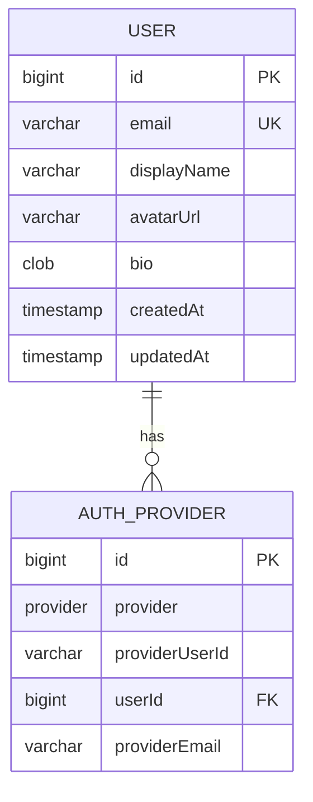

# 🏗️ System Architecture Documentation

## 📋 Architecture Overview

This document describes the comprehensive architecture of the Spring Boot OAuth2 Profile Management System, including system design, component relationships, and deployment considerations.

## 🏛️ System Architecture Diagram

```mermaid
graph TB
    %% Main Application Layer
    A[Spring Boot Application] --> B[Security Layer]
    A --> C[Web Layer]
    A --> D[REST API Layer]
    A --> E[Service Layer]
    A --> F[Database Layer]

    %% Security Layer Components
    B --> G[Spring Security OAuth2]
    G --> H[OAuth2 Client]
    G --> I[Session Management]
    G --> J[CSRF Protection]

    %% OAuth2 Providers
    H --> K[GitHub OAuth2]
    H --> L[Google OAuth2]

    %% Web Layer Components
    C --> M[Thymeleaf Engine]
    C --> N[Static Resources]
    C --> O[Bootstrap 5.3.0]

    %% REST API Layer
    D --> P[/profile - JSON API]
    D --> Q[/profile - Update API]
    D --> R[/debug/users - Admin API]

    %% Service Layer
    E --> S[CustomOAuth2UserService]
    E --> T[User Management]
    E --> U[AuthProvider Management]

    %% Database Layer
    F --> V[H2 Database]
    V --> W[User Table]
    V --> X[AuthProvider Table]

    %% External Dependencies
    K -.-> Y[GitHub API]
    L -.-> Z[Google Identity API]
    O -.-> AA[CDN Bootstrap]
```

## 🏢 Component Architecture

### **1. Frontend Layer (Presentation)**
- **Pure HTML/CSS/JavaScript** - No server-side templating complexity
- **Bootstrap 5.3.0** - Responsive design framework
- **Fetch API** - Modern AJAX for REST communication
- **Real-time Validation** - Client-side form validation and feedback

**Key Components:**
- `profile.html` - Main profile management interface
- `error.html` - Error handling and user feedback
- `index.html` - Home page with OAuth2 login buttons
- JavaScript modules for API communication

### **2. Backend Layer (Application)**
- **Spring Boot 3.5.6** - Modern Java web framework
- **Spring Security OAuth2** - Authentication and authorization
- **JPA/Hibernate** - Database persistence and ORM
- **Maven** - Dependency management and build automation

**Key Components:**
- `UserController` - REST API and web page endpoints
- `CustomOAuth2UserService` - OAuth2 user processing and persistence
- `SecurityConfig` - Authentication and authorization configuration

### **3. Data Layer (Persistence)**
- **H2 Database** - Development database with console interface
- **JPA Entities** - User and AuthProvider domain models
- **Repository Pattern** - Data access abstraction
- **Database Relationships** - User ↔ AuthProvider associations

### **4. Security Layer (Protection)**
- **OAuth2 Authorization Code Flow** - Secure token exchange
- **Session Management** - Server-side session storage
- **CSRF Protection** - Form submission security
- **Endpoint Protection** - Authentication-required resources

## 🔄 Data Flow Architecture

### **OAuth2 Authentication Flow**


### **Profile Management Flow**


## 🗄️ Database Architecture

### **Entity Relationship Diagram**


### **Database Schema Details**

#### **User Table**
```sql
CREATE TABLE user (
    id BIGINT GENERATED BY DEFAULT AS IDENTITY,
    email VARCHAR(255) NOT NULL UNIQUE,
    display_name VARCHAR(255),
    avatar_url VARCHAR(255),
    bio CLOB,
    created_at TIMESTAMP(6),
    updated_at TIMESTAMP(6),
    PRIMARY KEY (id)
);
```

#### **AuthProvider Table**
```sql
CREATE TABLE auth_providers (
    id BIGINT GENERATED BY DEFAULT AS IDENTITY,
    provider ENUM('GITHUB','GOOGLE','LOCAL') NOT NULL,
    provider_user_id VARCHAR(255) NOT NULL,
    user_id BIGINT NOT NULL,
    PRIMARY KEY (id),
    UNIQUE (provider, provider_user_id),
    FOREIGN KEY (user_id) REFERENCES user(id)
);
```

## 🔒 Security Architecture

### **Authentication Architecture**
- **OAuth2 Authorization Code Flow** - Industry-standard secure authentication
- **Session-based Security** - Server-side session management (no JWT complexity)
- **Provider Integration** - GitHub and Google OAuth2 application configuration
- **User Mapping** - AuthProvider table maintains cross-provider user relationships

### **Authorization Architecture**
- **Endpoint Protection** - Spring Security configuration with authentication requirements
- **CSRF Protection** - Token-based form submission protection
- **Session Security** - Secure cookie configuration with proper flags
- **Logout Handling** - Complete session cleanup and invalidation

### **OAuth2 Provider Integration**

#### **GitHub OAuth2 Integration**
- **Client Configuration** - GitHub OAuth2 app with proper redirect URIs
- **User Profile Access** - GitHub API integration for user data
- **Fallback Email Handling** - GitHub login as email when email scope not available
- **Provider User ID** - GitHub user ID for account linking

#### **Google OAuth2 Integration**
- **OIDC Integration** - Google OpenID Connect for authentication
- **Profile Information** - Google account data and email access
- **Email Verification** - Google account email validation
- **Provider User ID** - Google subject (sub) claim for account linking

## 🚀 Deployment Architecture

### **Development Environment**
- **Local Development Server** - Spring Boot embedded Tomcat
- **H2 Database** - In-memory database with web console
- **Hot Reload** - Spring Boot DevTools for rapid development
- **Debug Logging** - Comprehensive logging for troubleshooting

### **Production Environment**
- **Application Server** - Tomcat/Undertow deployment ready
- **PostgreSQL/MySQL** - Production database support (schema ready)
- **Environment Variables** - OAuth2 credentials configuration
- **Session Clustering** - Multi-server session management support

### **Configuration Management**
```properties
# Development (H2)
spring.datasource.url=jdbc:h2:mem:testdb
spring.h2.console.enabled=true

# Production (PostgreSQL)
spring.datasource.url=jdbc:postgresql://localhost:5432/oauth2_profile
spring.jpa.database-platform=org.hibernate.dialect.PostgreSQLDialect
```

## 🔧 System Components

### **1. Spring Boot Application Core**
- **Main Application Class** - Spring Boot application entry point
- **Component Scanning** - Automatic bean discovery and wiring
- **Configuration Properties** - Externalized configuration management
- **Health Checks** - Application monitoring and status

### **2. Security Configuration**
- **OAuth2 Client Configuration** - GitHub and Google client registration
- **Security Filter Chain** - Request filtering and protection
- **Session Management** - Concurrent session control
- **Logout Configuration** - Secure session termination

### **3. OAuth2 User Service**
- **Custom User Processing** - OAuth2 user information handling
- **Database Persistence** - User and AuthProvider record management
- **Provider-specific Logic** - GitHub vs Google data processing
- **Error Handling** - Comprehensive exception management

### **4. Web Controllers**
- **UserController** - Profile management endpoints
- **ErrorController** - Error handling and user feedback
- **Request Mapping** - RESTful endpoint design
- **Response Handling** - JSON and HTML response management

### **5. Data Access Layer**
- **Repository Interfaces** - JPA repository pattern implementation
- **Entity Management** - JPA entity lifecycle management
- **Query Optimization** - Efficient database queries
- **Transaction Management** - Database transaction handling

## 🌐 API Architecture

### **REST API Endpoints**

| Endpoint | Method | Purpose | Response |
|----------|--------|---------|----------|
| `GET /` | GET | Home page with login buttons | HTML |
| `GET /profile` | GET | Get user profile data | JSON |
| `POST /profile` | POST | Update user profile | JSON |
| `GET /profile/view` | GET | HTML profile management page | HTML |
| `GET /logout` | GET | Logout user | Redirect |
| `GET /h2-console` | GET | Database console | HTML |
| `GET /debug/users` | GET | Debug user data | Plain Text |

### **API Response Formats**
- **JSON** - For AJAX calls and API consumers
- **HTML** - For web page rendering
- **Plain Text** - For debug and administrative endpoints
- **Redirects** - For navigation and logout

## 📊 Performance Architecture

### **Optimization Strategies**
- **Database Connection Pooling** - HikariCP for optimal database performance
- **Static Resource Optimization** - CDN-hosted Bootstrap and icons
- **Minimal Dependencies** - Clean dependency management
- **Efficient Queries** - Optimized JPA queries with proper indexing

### **Scalability Considerations**
- **Stateless Design** - REST API supports horizontal scaling
- **Session Management** - Scalable session storage options
- **Database Optimization** - Efficient data access patterns
- **Frontend Caching** - Browser-level response caching

## 🔍 Monitoring & Debugging

### **Logging Architecture**
- **OAuth2 Flow Logging** - Provider interaction tracking
- **Database Operation Logging** - Persistence monitoring
- **Security Event Logging** - Authentication tracking
- **Error Logging** - Exception tracking and debugging

### **Debug Endpoints**
- **/debug/users** - View all users in database
- **/test-oauth** - Test OAuth2 principal information
- **H2 Console** - Direct database access and querying

## 🚀 Deployment Strategy

### **Development Deployment**
```bash
./mvnw spring-boot:run
# Access: http://localhost:8080/
# H2 Console: http://localhost:8080/h2-console
```

### **Production Deployment**
```bash
./mvnw clean package
java -jar target/spring-oauth2-profile-0.0.1-SNAPSHOT.jar
```

### **Environment Configuration**
- **OAuth2 Credentials** - Environment variables or properties file
- **Database Configuration** - Production database connection
- **Session Configuration** - Production session management
- **Security Headers** - Production security configuration

## 🛠️ Development Workflow

### **Package Structure Benefits**
- **Separation of Concerns** - Clear component boundaries
- **Maintainability** - Easy to locate and modify components
- **Testability** - Isolated testing of individual layers
- **Scalability** - Easy to add new features and components

### **Code Organization**
- **Config Package** - Security and application configuration
- **Controller Package** - Web layer and API endpoints
- **Service Package** - Business logic and OAuth2 processing
- **Repository Package** - Data access layer
- **Model Package** - Domain entities and enums
- **DTO Package** - Data transfer objects

## 📈 Future Enhancements

### **Potential Improvements**
- **Database Migration** - PostgreSQL/MySQL for production scale
- **Mobile API** - REST endpoints for mobile applications
- **Email Notifications** - Welcome and profile update emails
- **Social Features** - User discovery and following capabilities
- **Admin Dashboard** - User management interface
- **Advanced Search** - Find users by name or interests

### **Performance Optimizations**
- **Caching Layer** - Redis for session and data caching
- **CDN Integration** - Static resource optimization
- **Database Indexing** - Optimized query performance
- **Connection Pooling** - Advanced database connection management

## 🏆 Architecture Quality Assessment

### **Strengths**
- **Clean Architecture** - Well-organized, maintainable structure
- **Security First** - Comprehensive security implementation
- **Modern Technologies** - Current best practices and frameworks
- **Scalable Design** - Ready for production deployment
- **Developer Experience** - Easy to understand and extend

### **Production Readiness**
- **Database Migration Path** - H2 to PostgreSQL/MySQL ready
- **Security Hardened** - CSRF, session management, OAuth2
- **Error Handling** - User-friendly error management
- **Logging** - Comprehensive debugging and monitoring
- **Documentation** - Complete setup and deployment guides

## 🎯 Conclusion

This architecture provides a robust, scalable, and maintainable foundation for OAuth2-based user profile management with modern web technologies, security best practices, and production-ready deployment capabilities.

