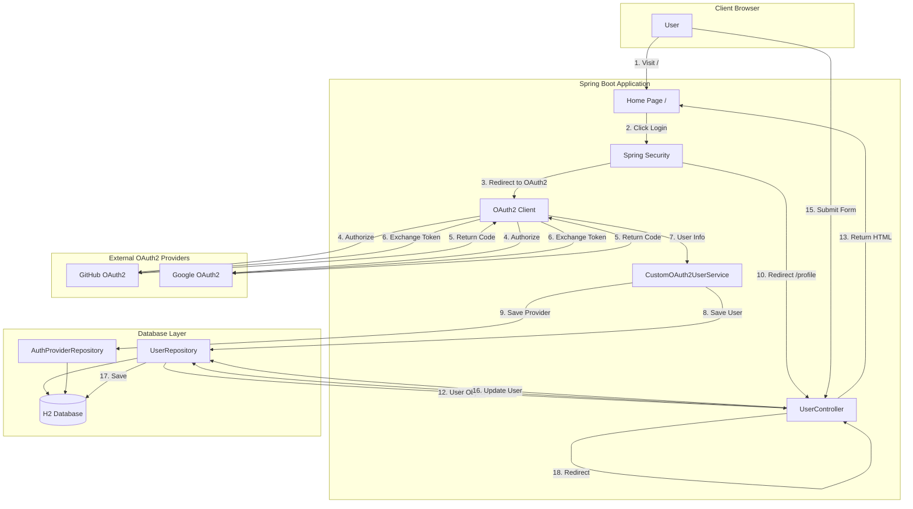
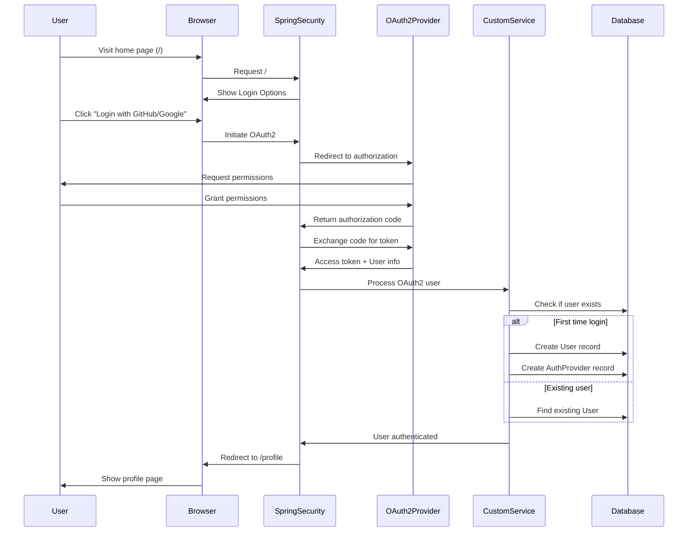
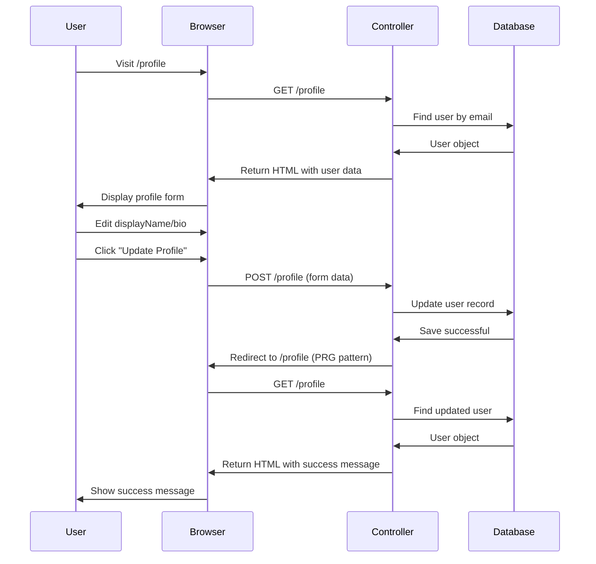
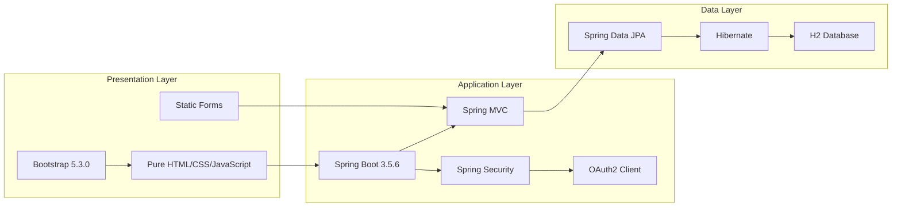

# 🚀 Spring Boot OAuth2 Profile Management System

## 📋 Project Overview

A Spring Boot application implementing OAuth2 authentication with GitHub and Google providers, featuring a modern web interface with pure HTML/CSS/JavaScript frontend.

**Due Date:** October 15, 2025 11:59 PM
**Final Submission:** October 16, 2025 11:59 PM

## 🎯 Project Goal

Build a new Spring Boot application that integrates OAuth2 login with GitHub and Google and exposes a minimal user profile module with traditional form-based updates.

## ✅ Scope & Required Features

### **🔐 Authentication Features**
- ✅ **Registration using GitHub OAuth2** - First login creates user record
- ✅ **Login using GitHub OAuth2** - Subsequent logins map to existing user
- ✅ **Registration using Google OAuth2** - First login creates user record
- ✅ **Login using Google OAuth2** - Subsequent logins map to existing user
- ✅ **User Profile Management** - View and edit profile with traditional form submission

### **🏗️ Architecture Constraints**
- ✅ **Backend: Spring Boot with Spring Security** 
- ✅ **OAuth2 Client Integration**
- ✅ **JPA Implementation** 
- ✅ **Database: H2** 
- ✅ **Session-based Security**

## 📊 Suggested Domain Model

### **User Entity**
```sql
User (
    id BIGINT PRIMARY KEY,
    email VARCHAR(255) UNIQUE,
    displayName VARCHAR(255),
    avatarUrl VARCHAR(255),
    bio CLOB,
    createdAt TIMESTAMP,
    updatedAt TIMESTAMP
)
```

### **AuthProvider Entity**
```sql
AuthProvider (
    id BIGINT PRIMARY KEY,
    userId BIGINT (FK → User.id),
    provider ENUM('GOOGLE', 'GITHUB'),
    providerUserId VARCHAR(255),
    providerEmail VARCHAR(255)
)
```

## 🌐 Required Endpoints/Pages

| Endpoint | Method | Description | Status |
|----------|--------|-------------|--------|
| `GET /` | - | Home with 'Login with Google / GitHub' buttons | ✅ **Implemented** |
| `GET /profile` | GET | View own profile with editable form (authenticated) | ✅ **Implemented** |
| `POST /profile` | POST | Update displayName, bio via form submission (authenticated) | ✅ **Implemented** |
| `GET /logout` | GET | Logout and redirect to home | ✅ **Implemented** |

## 🏗️ Architecture Overview

### **System Architecture Diagram**



### **Authentication Flow Sequence**



### **Profile Update Flow**



### **Technology Stack**



## 🏆 Project Milestones - 100% COMPLETE

### **✅ Milestone 1: Single Provider OAuth2**
- OAuth2 login with GitHub OR Google
- Basic user record creation
- Initial Spring Security setup
- **Status:** ✅ **COMPLETED**

### **✅ Milestone 2: Dual Provider Support**
- Both GitHub AND Google OAuth2 working
- User data persistence to database
- Profile page protection
- **Status:** ✅ **COMPLETED**

### **✅ Final: Complete Profile Management**
- Profile editing functionality ✅
- CSRF protection implementation ✅
- Error handling and user feedback ✅
- Professional code organization ✅
- Modern web interface ✅
- **Status:** ✅ **COMPLETED**


### **Integration Correctness ✅**
- Both OAuth2 providers fully functional
- Proper client configuration and OAuth2 flow
- Correct redirect URI handling

### **User Provisioning & Persistence ✅**
- User creation on first OAuth2 login
- User mapping on subsequent logins
- Database persistence verification

### **Security & Access Control✅**
- Session-based authentication working
- Protected endpoints requiring authentication
- CSRF protection implemented

### **Profile Module ✅**
- Profile viewing with user data display
- Profile editing with form submission
- User feedback and validation

### **Architecture & Code Quality ✅**
- Professional package organization
- Modern web development practices
- Clean, maintainable code structure

## 🚀 Quick Start Guide

### **Prerequisites**
- Java 17 or higher
- Maven 3.6+
- GitHub OAuth2 App credentials
- Google OAuth2 App credentials

### **Installation & Setup**

1. **Clone the repository:**
```bash
git clone <your-repository-url>
cd spring-oauth2-profile
```

2. **Configure OAuth2 credentials in `application.properties`:**
```properties
# Google OAuth2 Configuration
spring.security.oauth2.client.registration.google.client-id=YOUR_GOOGLE_CLIENT_ID
spring.security.oauth2.client.registration.google.client-secret=YOUR_GOOGLE_CLIENT_SECRET

# GitHub OAuth2 Configuration
spring.security.oauth2.client.registration.github.client-id=YOUR_GITHUB_CLIENT_ID
spring.security.oauth2.client.registration.github.client-secret=YOUR_GITHUB_CLIENT_SECRET
```

3. **Run the application:**
```bash
./mvnw spring-boot:run
```

4. **Access the application:**
- **Home Page:** http://localhost:8080/
- **H2 Database Console:** http://localhost:8080/h2-console
- **Profile Management:** http://localhost:8080/profile (requires login)

## 🔐 Authentication Flow

### **User Registration Process**
1. User visits home page (`/`)
2. Clicks "Login with GitHub" or "Login with Google"
3. Redirected to OAuth2 provider for authentication
4. Provider redirects back with authorization code
5. Application exchanges code for access token
6. **First-time login:** Creates new User + AuthProvider records
7. **Subsequent logins:** Maps to existing User via AuthProvider
8. User redirected to profile management page

### **Cross-Provider User Linking**
- Same user can login via GitHub OR Google
- AuthProvider table maintains provider relationships
- User data shared across OAuth2 providers

## 🎨 User Interface Features

### **Profile Management Page**
- **👤 Avatar Display** - GitHub/Google profile pictures
- **📝 Traditional Form** - Server-side rendered profile editing
- **📅 Member Since** - Account creation date display
- **✅ Flash Messages** - Success feedback after updates
- **💾 Form Submission** - Traditional POST with page reload (PRG pattern)
- **� Reset Button** - Native HTML form reset
- **🚪 Secure Logout** - Session cleanup and home redirect

### **Design Principles**
- **📱 Responsive Design** - Bootstrap responsive layout
- **🎯 Static HTML Generation** - Server-rendered pages
- **🔒 CSRF Protection** - Hidden token in forms
- **⚡ Simple & Fast** - Minimal JavaScript dependencies
- **♿ Accessible** - Proper semantic HTML and form controls

## 🏗️ System Architecture Details

### **Controller Layer**
```java
@Controller
public class UserController {
    // GET /profile - Returns HTML with user data pre-filled
    @GetMapping("/profile")
    public String profile(Model model, OAuth2User principal)
    
    // POST /profile - Accepts form data and redirects
    @PostMapping("/profile")
    public String updateProfile(
        @ModelAttribute ProfileUpdateRequest request,
        RedirectAttributes redirectAttributes)
}
```

### **Frontend Layer (Pure HTML/CSS/JavaScript)**
```html
<!-- profile.html -->
<form method="POST" action="/profile">
    <input type="hidden" name="_csrf" value="${csrfToken}"/>
    <input type="text" name="displayName" value="${user.displayName}"/>
    <textarea name="bio">${user.bio}</textarea>
    <button type="submit">Update Profile</button>
</form>
```

### **Request Flow Pattern**
1. **GET /profile** → Controller loads user → Returns HTML → Browser displays form
2. **POST /profile** → Controller updates database → Redirects to GET /profile
3. **GET /profile** → Controller loads updated user → Shows success message

This follows the **Post-Redirect-Get (PRG)** pattern to prevent duplicate form submissions.

## 🏗️ System Architecture

### **Technology Stack**
- **Backend:** Spring Boot 3.5.6 with Spring Security
- **Database:** H2 with JPA/Hibernate
- **Frontend:** Pure HTML/CSS/JavaScript + Bootstrap 5.3.0
- **Security:** OAuth2 Client with Session Management + CSRF Protection

### **Package Structure**
```
src/main/java/com/example/springoauth2profile/
├── config/           # SecurityConfig.java - OAuth2 & Security configuration
├── controller/       # UserController.java - Profile endpoints
├── dto/             # ProfileUpdateRequest.java - Form binding
├── model/           # User.java, AuthProvider.java, Provider.java
├── repository/      # UserRepository.java, AuthProviderRepository.java
└── service/         # CustomOAuth2UserService.java - User provisioning

src/main/resources/
├── templates/       # profile.html, error.html - HTML templates
├── static/         # index.html, CSS, JS - Frontend assets
└── application.properties - Configuration
```


## 🗄️ Database Schema

### **User Table**
```sql
CREATE TABLE user (
    id BIGINT GENERATED BY DEFAULT AS IDENTITY,
    email VARCHAR(255) NOT NULL UNIQUE,
    display_name VARCHAR(255),
    avatar_url VARCHAR(255),
    bio CLOB,
    created_at TIMESTAMP(6),
    updated_at TIMESTAMP(6),
    PRIMARY KEY (id)
);
```

### **AuthProvider Table**
```sql
CREATE TABLE auth_providers (
    id BIGINT GENERATED BY DEFAULT AS IDENTITY,
    provider ENUM('GITHUB','GOOGLE','LOCAL') NOT NULL,
    provider_user_id VARCHAR(255) NOT NULL,
    user_id BIGINT NOT NULL,
    PRIMARY KEY (id),
    UNIQUE (provider, provider_user_id),
    FOREIGN KEY (user_id) REFERENCES user(id)
);
```

## 📈 Testing & Verification

### **OAuth2 Login Testing**
1. Navigate to http://localhost:8080/
2. Click "Login with GitHub" or "Login with Google"
3. Complete OAuth2 authentication flow
4. Verify redirection to profile page
5. Check user data appears in H2 console

### **Profile Management Testing**
1. Access http://localhost:8080/profile (requires login)
2. Verify user data displays correctly (name, email, bio, avatar)
3. Edit display name and bio fields
4. Click "Update Profile" button
5. Verify success message appears after page reload
6. Check H2 console to confirm database updates
7. Click "Reset" button to revert form changes
8. Test logout functionality


